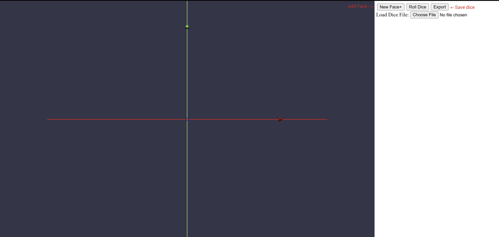
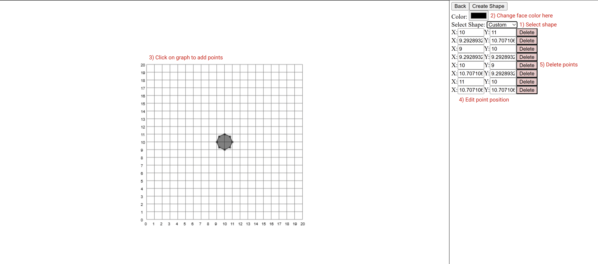
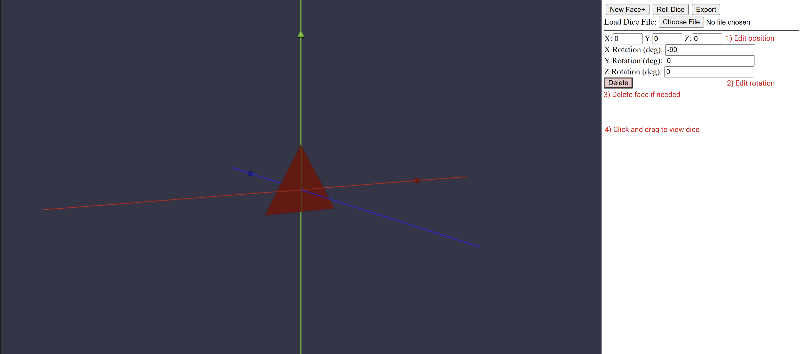
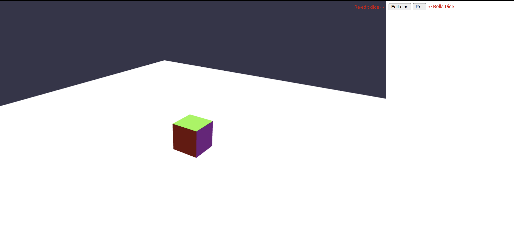

# Dice-Simulator

## How to download
#### Using Git
1. Open terminal, and run `git clone [repo-url]`

#### Using Zip file
1. Click the green Code button on top right and select `Download ZIP`
2. Unzip after download

## How to run
1. Open the HTML file in a browser, and it will automatically run

## Usage
#### Creating Dice
1. Click `New face+`

2. Add points and then click `Create Shape`

3. Edit face

#### Rolling Dice
1. Click `Roll Dice`
2. Click `Roll`
3. If you need to edit the dice, click `Edit dice`

#### Saving dice
1. Click `Export`. This will generate a JSON file containing the dice information.
2. The JSON does NOT contain a valid file for 3d printing and dice manufacturing. The dice in the file can only be run on the web app.

#### Uploading dice
1. Click `Load Dice File`, and select the JSON file containing the dice information. The data will populate the interface for further editing/demonstration
